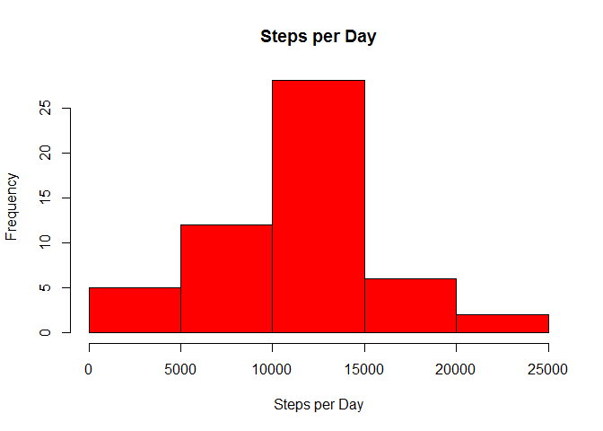
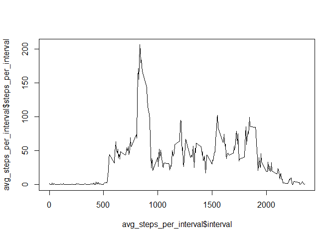
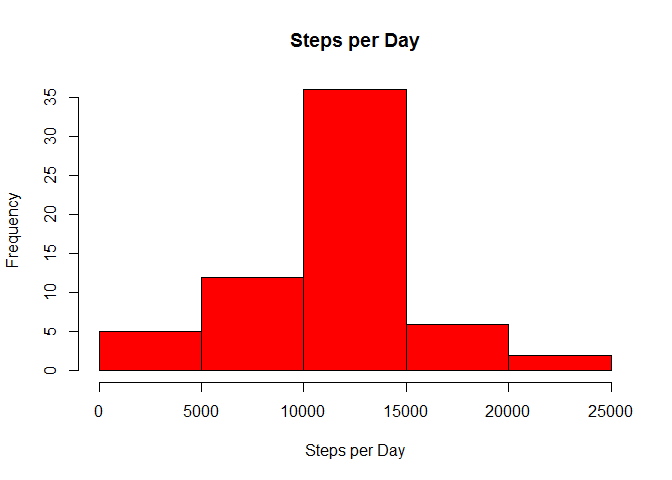
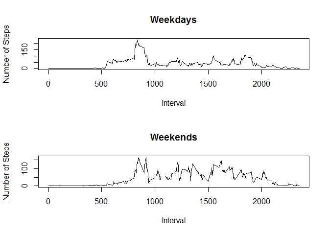

# Reproducible Research: Peer Assessment 1


## Loading and preprocessing the data


```r
## read in initial data file
step_data <- read.csv(file="activity.csv", colClasses = c("numeric","character","numeric"), header = TRUE,na.strings="NA")

library(lubridate)  ## to reformat date field
library(dplyr)  ## to perform processing in downstream steps
```

```
## 
## Attaching package: 'dplyr'
## 
## The following objects are masked from 'package:lubridate':
## 
##     intersect, setdiff, union
## 
## The following object is masked from 'package:stats':
## 
##     filter
## 
## The following objects are masked from 'package:base':
## 
##     intersect, setdiff, setequal, union
```

```r
## convert date field from text to date
step_data$date <- mdy(step_data$date)

## to prevent output in scientific notation and limit decimal places
options(scipen=999, digits=1)
```

## What is mean total number of steps taken per day?


```r
##convert to a data frame
df_step_data <- as.data.frame(step_data)
## Make data frame without NA records
df_step_data_no_NA <- filter(df_step_data,!is.na(steps))
#group df_step_data by date
by_day <- group_by(df_step_data_no_NA,date)  
##calculate steps per day
daily_steps <- summarise(by_day, steps_per_day=sum(steps, na.rm=TRUE))
## calculate mean steps per day
mean_spd <- mean(daily_steps$steps_per_day)
## calculate median steps per day
med_spd <- median(daily_steps$steps_per_day)
## make histogram
hist(daily_steps$steps_per_day,col="red",main="Steps per Day",xlab="Steps per Day")
```

 
  
#### mean steps per day: 10766.2
#### median steps per day: 10765
  

## What is the average daily activity pattern?


```r
#group data by interval
by_interval <- group_by(df_step_data_no_NA,interval)
##calculate average steps per interval
avg_steps_per_interval <- summarise(by_interval, steps_per_interval = mean(steps, na.rm=TRUE))

## Find interval with maximum average steps
## order avg_steps_per_interval in descending order of steps_per_interval
descending_order <- avg_steps_per_interval[order(-avg_steps_per_interval[,2]),]
## Identify interval corresponding to maximum average steps
interval_max <- descending_order[1,1]
## Make a line plot of average steps as a function of time interval
plot(avg_steps_per_interval$interval,avg_steps_per_interval$steps_per_interval,type="l")
```

 

#### interval with maximum average steps: 835
 
 
## Imputing missing values


```r
## Set up a data frame with just the rows where steps is NA
df_NA <- filter(df_step_data,is.na(steps))
## Calculate number of NA records
NA_rows <- nrow(df_NA)

## Combine columns from df_NA and avg_steps_per_interval
combo <- merge(df_NA,avg_steps_per_interval,by = "interval")
## Revise df_NA so that it now has values for steps (averages for interval)
df_NA_revised <- combo %>% select(steps_per_interval,date,interval)
## Correct the column names
colnames(df_NA_revised) <- c("steps","date","interval")
## recombine records with NA values removed and records with NA values replaced.
back_together <- rbind(df_step_data_no_NA,df_NA_revised)

#group df_step_data by date
together_by_day <- group_by(back_together,date)
##calculate steps per day
together_daily_steps <- summarise(together_by_day, steps_per_day=sum(steps, na.rm=TRUE))
## calculate mean steps per day
mean_tds <- mean(together_daily_steps$steps_per_day)
## calculate median steps per day
median_tds <- median(together_daily_steps$steps_per_day)
## make histogram
hist(together_daily_steps$steps_per_day,col="red",main="Steps per Day",xlab="Steps per Day")
```

 
  
#### number of records with NA: 2304
#### mean steps per day (including imputed values): 10766.2
#### median steps per day (including imputed values): 10766.2
 
#### Observations relating to the histograms and mean/median steps per day:  
I replaced the NA values with the average values corresponding to their respective time periods.  In the histogram of Steps per Day, this had the effect of reinforcing the already dominant range of values (10000 to 15000 steps per day).  In the original histogram, which omitted NA records, about 27 days corresponded to this range.  Once values were imputed for the NA records, this increased to 35 days. The mean value is the same as prior to the assignment of imputed values to the NA records; the median value has now become equal to the mean value.

## Are there differences in activity patterns between weekdays and weekends?


```r
## Determine weekdays corresponding to dates
back_together$day <- weekdays(back_together$date)
## Create a new field to indicate "weekday" versus "weekend"
back_together$weekday_or_end <- "weekday"
## Change "Weekday" to "weekend" when day is "Saturday" or "Sunday"
back_together$weekday_or_end[back_together$day == "Saturday"] <- "weekend"
back_together$weekday_or_end[back_together$day == "Sunday"] <- "weekend"
## Create separate data frames for weekdays and weekends
weekdays <- filter(back_together,weekday_or_end == "weekday")
weekends <- filter(back_together,weekday_or_end == "weekend")

## Arrange for plots to be one above the other.
par(mfcol=c(2,1))

## Make plot for weekdays
#group data by interval
by_weekdays_interval <- group_by(weekdays,interval)
##calculate average steps per interval
avg_steps_per_weekdays_interval <- summarise(by_weekdays_interval, 
                                             steps_per_interval = mean(steps, na.rm=TRUE))
## Make a line plot of average steps as a function of time interval
plot(avg_steps_per_weekdays_interval$interval,avg_steps_per_weekdays_interval$steps_per_interval,
     main="Weekdays",xlab="Interval",ylab="Number of Steps",type="l")

## Make plot for weekends
## group data by interval
by_weekends_interval <- group_by(weekends,interval)
##calculate average steps per interval
avg_steps_per_weekends_interval <- summarise(by_weekends_interval, 
                                             steps_per_interval = mean(steps, na.rm=TRUE))
## Make a line plot of average steps as a function of time interval
plot(avg_steps_per_weekends_interval$interval,avg_steps_per_weekends_interval$steps_per_interval,
     main="Weekends",xlab="Interval",ylab="Number of Steps",type="l")
```

 


